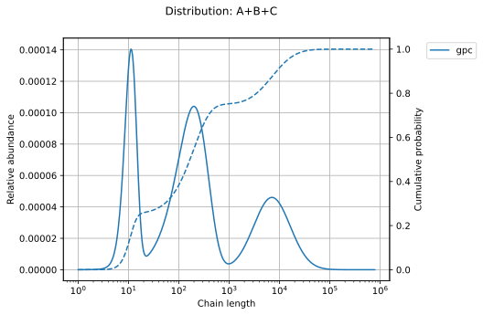

# Welcome to PolyKin's documentation

`PolyKin` is an open-source polymerization kinetics library for Python. It is still at an early
development stage, but the following modules can already be used:

- [x] copolymerization
- [x] distributions
- [x] kinetics
- [x] math
- [x] properties
- [x] stepgrowth
- [x] thermo

  

