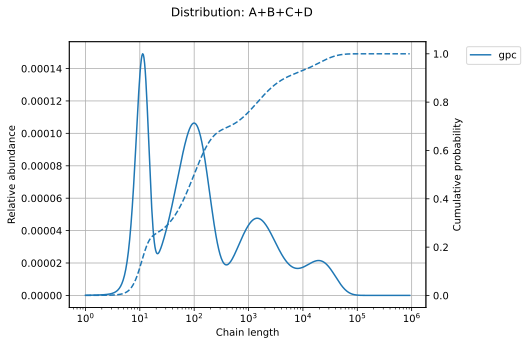

# Welcome to PolyKin

`PolyKin` is an open-source polymerization kinetics library for Python. It is still in its
infancy, but some modules are already in a functional state:

- [x] distributions
- [ ] copolymerization  
 

  

